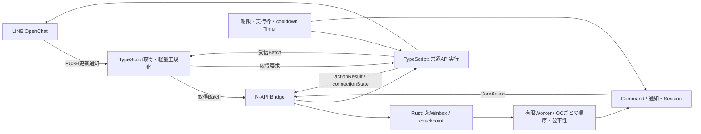

# Rust CoreとLINEJS Adapterの構成案

作成日: 2026-10-01、更新日: 2026-10-02（JST）
状態: 全体構成は移植計画。3 crate・型生成・Native・PUSH Adapterとtxt / ut / tut / stを実装済み。受信基本方針のOC PUSH・cursor単位の直列化・独立処理の有限並列は採用。第一段階はOpenChat専用。現行実装は[Runtime](../../crates/kbc-core/docs/RUNTIME.md)と[Adapter](../../apps/line/docs/ADAPTER.md)を参照。

## 1. 処理経路

受信処理とCommand完了を分け、API応答の待機で受信受付が止まらない経路にする。RustへLINEJSのClient、Message、Blob、Errorを渡さない。DiscordのGuild、Role、Reaction等をLINEの概念へ無理に置き換えない。

## 2. 責務と所有者

| 対象 | 所有者 | 境界 |
| --- | --- | --- |
| LINEJS、認証・復号・token更新 | TS Adapter | SDK固有処理。機密情報をCommandへ渡さない |
| LINE接続と受信器の寿命 | TSのConnectionController / ReceiverSupervisor | 単一接続管理。必要な受信器を局所復旧 |
| 使用中のcursor・取得の意味 | TS受信層 | SDKのsync / continuation / subscriptionを解釈する |
| 受付済みEvent・永続checkpoint | Rust IngressStore | Batch受付と対応checkpointの整合性、重複・再開 |
| LINEJS例外の正規化 | TS Adapter | 安定したcodeと接続状態へ変換。生の例外をProtocolへ出さない |
| Command解析・権限・停止・対象場所 | Rust Core | Adapter内でPrefixやCommand固有の判断をしない |
| 検索・モデレーション判断・通知条件 | Rust Core | 必要なLINE照会・操作はActionとして依頼 |
| 対話・Task・進捗・配送予定 | Rust Core | owner / chat / TTL、有限数、取消、期限を管理 |
| 機能データ・外部HTTP・Cache・GitHub同期 | Rust Core | 共通Service。正本・保存形式は機能別に確定 |
| 全LINE APIの実通信と許可枠 | TSの共通ApiScheduler | 受信・送信・照会を観測し、共通予算・順序・cooldownを適用 |
| Node / cgroup / 接続の観測 | TS Adapter | plain snapshotをCoreの状態表示へ渡す |

認証情報のTransportStoreと受信checkpointを分ける。checkpointにはアカウント所有者と接続世代の必要な識別を含める。新しい受信層が確定するcursorはRustの受付確認後に進める。SDK内部の先行cursorとは区別する。取得Batchとcheckpointの細かな構造はPhase 0で確定する。

[受信方式の決定](../decisions/PUSH_AND_BOUNDED_CONCURRENCY_V1.md)により、OC PUSHを基本にする。同じcursor系統の取得と受付確認は直列、独立したトークの取得・Command・配送は有限並列にする。[最新3.4.2のProbe](../../experiments/linejs-receiver/docs/RECEIVER_PROBE.md)でSDK既定ループに対策が必要と分かった点は残るため、無変更での本運用は保留する。公開Square APIの直列取得Probeを比較基準として、次の受付・復旧契約を定義する。

LINE接続の復旧はAdapter共通部へ閉じ込め、Commandから再ログインやrefreshを呼ばせない。Coreは接続不可・制限を受け、新規の通知・Task・操作を抑止する。業務処理の再試行はCore、LINE接続の復旧は単一の接続管理で行い、同じ操作を両方で再試行しない。

## 3. Protocolと受付

Envelopeは `protocolVersion` 、 `eventId/actionId` 、 `requestId` を持つ。IDはString、Rustのtagged enumからTypeScript型を生成する。LINEのProtocol VersionはDiscordと独立して管理し、不一致なら起動を失敗させる。

最初はOC疎通・受付・配送に必要な型だけを定義する。

- Event: `messageReceived` 、 `actionResult` 、 `connectionStateChanged` 。
- 取得Batch: 正規化した有限Event群と、opaqueな次checkpoint・所有アカウント等。
- Action: `sendMessage` 。照会・画像・削除・処分は利用するPhaseで追加する。
- メッセージ: トーク・Square・送信者・元message ID、本文、作成時刻、必要ならリプライ元・thread ID。
- 未対応イベントを理由なく黙って捨てず、対象外の種別と件数を観測する。
- 重複排除: アカウント / トーク / message ID / 作成・編集等の意味。raw Eventの受信元が違うだけで別メッセージにしない。
- 結果: 成功 / 確定失敗 / 結果不明を分け、Action IDで照合する。
- 再接続前の結果を新しい接続へ混ぜない。大きいデータをJSON / base64で繰り返し往復させない。

N-APIは `getRuntimeInfo()` 、 `createCore()` 、受付API、 `nextAction()` 、 `shutdown()` を第一候補にする。受付APIは単一Event投入だけでなく、取得Batchの永続受付が完了したことを返せる契約を設計する。Command単位のN-API関数は作らない。

ActionResultは新しいLINE取得Batchとは別に有限な結果経路で受ける。結果を待っているCommandが通常入力を塞ぎ、その結果自身も同じ待機列に塞がる循環待ちを避ける。

## 4. 対象場所

第一段階はOpenChatのみ。参加OCの各トーク・サブトークは原則利用可能とし、OC用の事前許可リストは作らない。旧版の権限・停止設定と、実際の参加・操作可能状態は維持する。

個人・グループは後続段階でOC内から許可設定する。設計上のトーク種別は拡張できるようにするが、今はTalk受信・復号・許可UIを実装しない。未参加OCへ設定や購読が残っていても、APIを繰り返し呼ばない。

## 5. Inboxと処理の順序

- 受信後は軽量な正規化と受付だけを行い、名前解決・moderation・Command実行を切り離す。
- APIが返したBatch全体の受付とcheckpointを整合して保存する。途中失敗で後ろのメッセージまで既受付扱いにしない。
- 永続Inboxは件数・byte・保存期間に上限を持つ。満杯時は新規取得を抑え、受信lagと容量を通知・観測する。
- checkpointが保存されても未処理Eventを復元できるようにする。起動時刻だけで既処理と判断しない。
- 初回同期の履歴を無差別にCommand実行しない。初回baselineと通常再開のcheckpointを区別して設計する。
- 同じOCの状態更新・対話の入力順を保ち、忙しいOCが他OCを占有しない公平性を持つ。
- 取得元から再取得できる期間と上限を調べ、受信抑制だけで永久に保持されるとは仮定しない。
- Event取得・受付・処理・Action生成・配送の各段階をmessage ID / request IDで追跡する。

保存形式は小さなSQLite transactionを第一候補に比較する。利点はEventとcheckpointの同時保存・再開を独自ファイル手順で作り込まずに扱えること。負担は依存関係、ディスクI/O、保持上限・削除・batchサイズの管理である。Phase 0で判断し、既存の機能データ移行と分ける。

## 6. API制御と自律的な起床

業務的な優先度はCoreが指定し、通信可能な枠・間隔・cooldownの所有者は共通ApiSchedulerに限定する。

- 送信・削除だけでなく受信、名前・メンバー照会、背景巡回、SDK内部要求を一覧化する。
- SDKがcustom fetch等で観測・制御できる境界と、内部で直接通信する経路を採用版で確認する。
- アカウント全体の予算、必要なAPI種別・OC別制御を置く。長時間受信待ちが返信枠を占有しない構成にする。
- 同じ宛先で依存するActionは順序を守り、独立した宛先は有限並行にする。
- 優先枠で背景巡回・通知が受信と軽量応答を塞がないようにし、通常処理の飢餓も観測する。
- LINE側の制限応答はretry可否・待機時間・scopeに正規化する。即座に別経路で再試行しない。
- SDKの内部待機・再試行とアプリ側の制御を二重化しない。旧版の50msは安全な全API上限を表すものではない。
- 次の実行可能時刻を単一の期限管理で起床する。enqueue、完了、再開、cooldown終了、通知期限のどれでも進行できるようにする。
- 応答待ちのtimeoutと実通信の取消を分ける。取消せない通信を「終わった」として実並列数を増やさない。
- すべてのAPI照会を単一の巨大FIFOに並べ、long pollが他の通信を塞ぐ形にも作り替えない。

PUSHを主な起点に `fetchMyEvents` の更新を取得し、OC別補助取得は不足する種類と必要なトークへ限定する。短時間RPCの全体上限はまず2並列を初期案とし、同じcursor系統の1取得もその内数とする。PUSH常時接続はRPCの配送枠を占有しない。並列数とAPI回数の予算を別々に管理し、[決定資料](../decisions/PUSH_AND_BOUNDED_CONCURRENCY_V1.md)の境界と[実測](../research/RECEIVER_AND_BACKGROUND_EXPERIMENTS.md)に従って調整する。SDK内部のBufferとcursor更新も、有限性・永続受付・再開の設計対象に含める。負Cache、重複照会の共有、期限起床と処理の分散で無通信時のAPI・CPUを減らす。

通知予定のTimerはCore、通信枠のTimerはApiSchedulerが所有し、それぞれの必要な起床を失わない。LINEアカウントの接続Sessionと対話Sessionも別の概念・名前にする。

## 7. 保存・停止・提案の負担

DiscordのStorageはGitHubを正本とするが、旧LINEの保存・復元は機能別に調べる。機能データは原子的なローカル書込、変更の記録、有限バッチ同期を基本候補にし、GitHub失敗で受信を止めない。

OCの長期ログは旧履歴を移行せず、新規開始する。既存の非公開GitHubストレージでOC MIDを親・トークMIDを子に置き、起動時に旧履歴を走査しない。長期ログと受信Inboxの保持・復旧は別の要件として扱う。[ログ保存の決定](../decisions/OC_LOG_STORAGE_V2.md)を参照。

LINEにDiscordと同じnonce保証があるとは仮定しない。送信結果不明は照合・管理者対応を選べるようにし、単純な自動再投稿で重複を作らない。

停止は新規受付と背景処理を止め、Receiver取消、永続受付完了、Core停止、ローカル保存、実行中Action回収を有限時間内に終える。未処理Inboxは残し、GitHub全同期やプロフィール名変更を終了の必須条件にしない。

旧CommandからSDK Clientへの直接依存を除くため、照会・操作をActionへ分割する必要がある。Core / Protocol / Bridge分離では型生成とNative buildを管理する。0.2コアではCPU重処理を無制限spawnせず、必要なService・Session・Taskを必要なPhaseだけ追加する。

## OC管理の実装境界（2026-10-03）

Protocol v5のOcRequest / Resultを既存Outboxへ接続し、OC設定・権限判断・対話・自動処分をRustへ配置した。TSはPUSHイベント正規化・有限OC対応cache・SDK入出力だけを担当する。読み取りは1照会loop、変更と返信は既存2配送loop、全APIの上限は共有する。[OC設計判断](../decisions/OC_MANAGEMENT_V1.md) と [実装・関数](../../crates/kbc-core/src/oc/docs/OC.md) を参照。

現行Protocolはv20。IDの照会・遠隔OC操作・履歴削除・Botの表示名更新も既存OC Outbox・照会Workerを共有し、独立したCommand専用Queueを作らない。PUSHと補助chat取得は同一cursorのPromiseを共有する。機能状態はRust DBが所有し、暗号化snapshot・ログgzipとGitHub入出力はAdapterが担当する。[現行Adapter](../../apps/line/docs/ADAPTER.md)。
