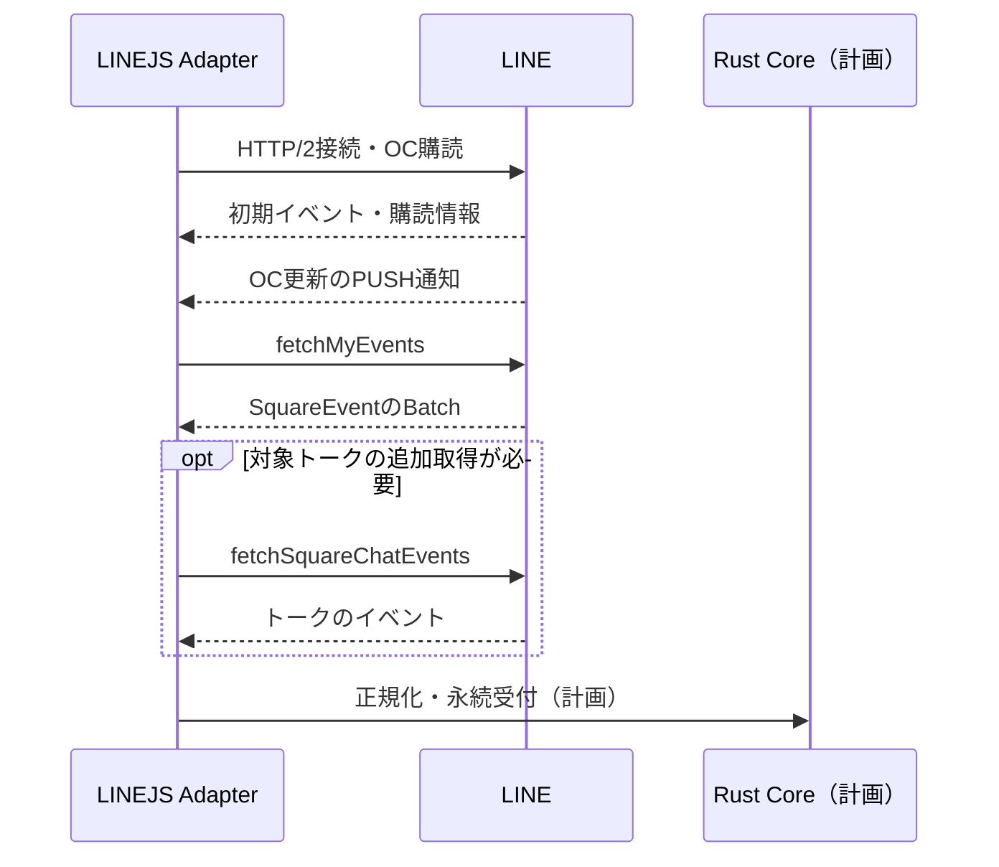

# OpenChatのPUSH受信で得られる情報

調査日: 2026-10-01〜2026-10-02（JST）
状態: LINEJS 3.4.2の配布物・開発元ソースと旧運用資料を確認。実LINEのPUSH接続・イベント別配信条件は未確認。2026-10-02にPUSHを基本の受信方式として設計採用。新Botへの実装は未実施。

## 1. 現在の実験とPUSHの違い

今回のLive Probeは `square.fetchMyEvents(limit: 100)` を直列に呼び、取得後に1秒待つ方式。アカウント側のOCイベントを取得し、OCごとに1秒巡回しているわけではない。最初の5分実験では257回取得した。現在のNorthflankサービスは停止0 / 0・Default configurationへ戻している。

LINEJSの通常の `listenSquareEvents()` は、BotからLINEへ持続するHTTP/2接続を開き、サーバー側の更新通知を受ける。外部公開URLへWebhookが届く構成ではない。OCのPUSH通知を受けると、SDKは通知の `subscriptionId` と現在の `syncToken` で `fetchMyEvents(limit: 100)` を呼び、返った `SquareEvent` をStreamへ流す。初期購読の応答でもイベントを取得する。

図の追加取得・Rust受付は新Botの候補で、SDK既定PUSHに実装済みの機能ではない。PUSH通知1件とメッセージ1件の一対一対応も仮定しない。

空の定期取得を減らせるため、特に無通信時や静かなOCが多い場合にはAPI回数・CPUを減らせると推測する。PUSHの実測比較はまだない。初期取得、通知後の取得、返信、追加照会、認証更新、再接続は通信を使う。SDKはkeepaliveへの応答に加え、一定のping IDで `talk.noop()` も呼ぶ。OC専用でも全通信を観測する。PUSHだけでAPI制限にかからなくなるとは扱わない。

## 2. 参加通知は得られるか

メッセージ以外の参加イベントを扱う型・APIはある。ただし「PUSHへ切り替えれば、画面に表示されない参加も全員分届く」とは確認できていない。更新の合図、アカウント側のイベント、トーク別の詳細を区別する。

| イベント | 定義された情報 | 用途と限界 |
| --- | --- | --- |
| `NOTIFICATION_NEW_CHAT_MEMBER`（42） | `squareChatMid`、`squareChatName` | 新メンバーに関する概要。参加者MID・名前はこのpayloadにない |
| `NOTIFIED_JOIN_SQUARE_CHAT`（2） | `squareChatMid`、`joinedMember: SquareMember` | 参加者を含む詳細。全体取得で毎回配信されるかは未確認 |
| `NOTIFIED_CREATE_SQUARE_MEMBER / NOTIFIED_CREATE_SQUARE_CHAT_MEMBER`（15 / 16） | OC / トークのメンバー生成情報 | 所属・参加の補完候補。生成・再取得を無条件に新規参加として通知しない |
| `NOTIFIED_UPDATE_SQUARE_MEMBER / NOTIFIED_UPDATE_SQUARE_CHAT_MEMBER`（11 / 14） | メンバー情報・状態の更新 | 参加退出状態の補完候補。状態変化を見て判断する |
| `NOTIFICATION_JOIN_REQUEST / NOTIFICATION_JOINED`（21 / 22） | 参加申請や所属更新の通知情報 | トーク参加の詳細とは別。管理権限・配信対象・必要項目を確認する |
| `NOTIFIED_SYSTEM_MESSAGE`（49） | `squareChatMid`、`text`、`messageKey` | システム表示の情報。構造化された参加者情報の代わりにはしない |

旧Botの `src/moderation/docs/oc_join_message.md` には、全体の `fetchMyEvents()` では参加時の `NOTIFIED_JOIN_SQUARE_CHAT` がリアルタイムに届かず、`fetchSquareChatEvents()` では同イベントを取得できたという運用記録がある。旧コードもトーク別の補助取得を持つ。これは旧版の条件での記録であり、3.4.2の実LINEで再確認した結果ではない。PUSHも全体取得に `fetchMyEvents` を使うため、取得の起点を変えるだけでこの差がなくなるとは推測しない。

LINE画面の参加表示、端末の通知ON / OFF、受信イベントの配信は別々に観測する。型に `SquareEventStatus.ALERT_DISABLED` はあるが、これだけでは通知OFF時の全件配信や参加表示OFF時の挙動を証明しない。

## 3. SquareEventで扱える情報の一覧

以下はPUSH後の取得やトーク別取得で使われる共通の型定義の一覧。全行を `fetchMyEvents` のPUSH経路で受信済みという意味ではない。取得元、アカウントの参加状態・権限、トーク設定、SDKが抽出するイベントを実LINEで区別する。

| 分類 | 定義されているイベント名 | 主な情報・新Botでの用途候補 |
| --- | --- | --- |
| メッセージ | `NOTIFICATION_MESSAGE`、`RECEIVE_MESSAGE`、`SEND_MESSAGE` | トーク・message ID、SquareMessage、表示名等。通常入力と自身の送信を照合 |
| メッセージ変更・削除 | `MUTATE_MESSAGE`、`NOTIFIED_DESTROY_MESSAGE`、`NOTIFIED_UPDATE_MESSAGE_STATUS` | 対象message IDや変更・状態。新規Command入力と区別 |
| リアクション・既読 | `NOTIFICATION_MESSAGE_REACTION`、`NOTIFIED_MARK_AS_READ` | 対象message ID、反応・メンバー等。誰の分が配信されるかは未確認 |
| 参加・招待 | `NOTIFIED_JOIN_SQUARE_CHAT`、`NOTIFIED_INVITE_INTO_SQUARE_CHAT`、`NOTIFICATION_NEW_CHAT_MEMBER`、`NOTIFICATION_JOIN_REQUEST`、`NOTIFICATION_JOINED` | 参加者の詳細、概要、申請を区別。入室通知や所属の更新 |
| 退出・処分・関係 | `NOTIFIED_LEAVE_SQUARE_CHAT`、`NOTIFIED_KICKOUT_FROM_SQUARE`、`NOTIFICATION_KICKED_OUT`、`NOTIFIED_UPDATE_SQUARE_MEMBER_RELATION` | 退出者・処分対象・関係等。トーク退出とOC全体の状態を区別 |
| メンバー生成・更新 | `NOTIFIED_CREATE_SQUARE_MEMBER`、`NOTIFIED_CREATE_SQUARE_CHAT_MEMBER`、`NOTIFIED_UPDATE_SQUARE_MEMBER`、`NOTIFIED_UPDATE_SQUARE_CHAT_MEMBER`、`NOTIFIED_UPDATE_SQUARE_MEMBER_PROFILE` | 所属・プロフィール・状態。必要な名前Cache等を更新 |
| 権限・役職 | `NOTIFIED_UPDATE_SQUARE_AUTHORITY`、`NOTIFICATION_PROMOTED_COADMIN`、`NOTIFICATION_PROMOTED_ADMIN`、`NOTIFICATION_DEMOTED_MEMBER` | OC権限や役職通知。利用者ごとの権限判定に必要な詳細を確認 |
| OC / トーク更新 | `NOTIFIED_UPDATE_SQUARE`、`NOTIFIED_UPDATE_SQUARE_STATUS`、`NOTIFIED_UPDATE_SQUARE_CHAT`、`NOTIFIED_UPDATE_SQUARE_CHAT_STATUS`、`NOTIFIED_UPDATE_SQUARE_CHAT_PROFILE_NAME`、`NOTIFIED_UPDATE_SQUARE_CHAT_PROFILE_IMAGE`、`NOTIFIED_UPDATE_SQUARE_FEATURE_SET`、`NOTIFIED_UPDATE_SQUARE_CHAT_FEATURE_SET`、`NOTIFIED_UPDATE_SQUARE_CHAT_MAX_MEMBER_COUNT`、`NOTIFIED_UPDATE_READONLY_CHAT` | 名前、画像、機能、人数上限、状態等。状態が変わった対象のCacheを更新 |
| OC / トーク終了 | `NOTIFIED_SHUTDOWN_SQUARE`、`NOTIFIED_DELETE_SQUARE_CHAT`、`NOTIFICATION_SQUARE_DELETE`、`NOTIFICATION_SQUARE_CHAT_DELETE` | 対象OC / トークの終了・削除。不要な購読・再照会を止める |
| Botの追加・削除 | `NOTIFIED_ADD_BOT`、`NOTIFIED_REMOVE_BOT` | 対象トーク、Bot・メンバー等。自身の利用可否を確認 |
| ノート・アナウンス | `NOTIFIED_UPDATE_SQUARE_NOTE_STATUS`、`NOTIFICATION_POST`、`NOTIFICATION_POST_ANNOUNCEMENT`、`NOTIFIED_UPDATE_SQUARE_CHAT_ANNOUNCEMENT` | ノートの通知・状態、アナウンス参照等。全本文を常に含むとは仮定しない |
| スレッド | `NOTIFICATION_THREAD_MESSAGE`、`NOTIFICATION_THREAD_MESSAGE_REACTION`、`NOTIFIED_UPDATE_THREAD`、`NOTIFIED_UPDATE_THREAD_STATUS`、`NOTIFIED_UPDATE_THREAD_MEMBER`、`NOTIFIED_UPDATE_THREAD_ROOT_MESSAGE`、`NOTIFIED_UPDATE_THREAD_ROOT_MESSAGE_STATUS` | スレッドの入力・反応・状態・参加者・親メッセージ。通常トークとcursor / IDを区別 |
| ライブトーク | `NOTIFIED_UPDATE_LIVE_TALK`、`NOTIFICATION_LIVE_TALK`、`NOTIFIED_UPDATE_LIVE_TALK_INFO` | 開催・招待・状態等。第一段階で必要なものだけ解釈 |
| システム・画面情報 | `NOTIFIED_SYSTEM_MESSAGE`、`NOTIFIED_CHAT_POPUP` | システム本文、popup情報等。通常Command入力と区別 |
| 購読 | `NOTIFIED_CREATE_SQUARE_SUBSCRIPTION`、`NOTIFIED_UPDATE_SQUARE_SUBSCRIPTION` | 購読に関する更新。配布物のpayload型が `any` の箇所は利用前に実体を確認 |

`NOTIFICATION_MESSAGE` のpayloadには `requiredToFetchChatEvents` が定義されている。追加のトーク取得判断に使う候補だが、値の配信条件や、falseなら全メッセージが含まれるかは未確認。今回のLive Probeはこの値を集計していない。通知に含まれる1メッセージだけを全履歴の代わりとして扱わない。

メンバー一覧や全過去履歴が自動的に届く方式とは扱わない。通知に含まれない表示名・本文・画像等が機能に必要な場合は、対象と目的を限定した追加照会としてAPI回数を数える。

## 4. LINEJSの関数と受信範囲

| 関数・イベント | 呼出関係と注意 |
| --- | --- |
| `Polling.listenSquareEvents()` | Square Streamをrenewし、LEGY pusherを開始。名前のpollingだけで定期取得と判断しない |
| `ConnManager.InitAndRead()` → `_OnSignOnResponse()` | OC購読を開始し、初期 `fetchMyEvents` 応答のイベント・同期情報を処理 |
| `Conn.onPacketReceived()` → `ConnManager._OnPushResponse()` | PUSHの必要なACKを返し、OCの購読IDから `fetchMyEvents` を実行。ACKはRustへの永続受付完了ではない |
| `Client.listen({ square: true })` → `square:event` | 全体取得からStreamへ来たrawイベントをemit。サーバーがこの経路に返さないイベントまで補うものではない |
| 同じ `Client.listen()` → `square:message` | `NOTIFICATION_MESSAGE` だけを高水準Messageへ変換。参加・退出・スレッド等をこれだけで網羅しない |
| `SquareChat.listen()` → `event / join / leave / message` | 別のトーク取得ループ。`fetchSquareChatEvents` を繰り返し、通常は取得後1秒待つ。`join` handlerがあることをPUSH全体の参加配信保証と読み替えない |
| `BaseClient.square.fetchSquareChatEvents()` | 対象トークやthreadの追加取得。全OCで常時起動するとOC数に比例して空取得が増える |

`Polling.listenTarget` の既定は `[3, 8]`（OCとTalk）。`Client.listen` のTalk handlerを無効にする指定だけでは、この購読対象を変更していない。第一段階の候補ではOC購読 `[3]` とhandlerの両方を明示して確認する。これとは別にSDKの `talk.noop()` は残るため、Talkメッセージを受けないこととTalk API通信0回を同一視しない。

## 5. 次の受信設計への反映

利用者の指定により、PUSHを基本の受信方式として採用した。[PUSHと有限並列の決定](../decisions/PUSH_AND_BOUNDED_CONCURRENCY_V1.md)に従い、同じcursorの取得を直列化し、独立した処理は有限並列にする。利点は空の定期取得削減と、固定1秒待ちによる遅延の削減。負担は持続接続、購読・再接続、SDK内部の取得とBufferを管理する必要があること。SDK既定ループを無変更で本運用する判断は、[認証なしProbeで確認した問題](../../experiments/linejs-receiver/docs/RECEIVER_PROBE.md)への対策と実LINE比較が済むまで保留する。

- PUSH通知は「取得が必要」という起床にまとめ、同じcursorの取得を直列にする。独立したトークの取得や配送は共通の有限枠で並列に進める。取得中の追加入力は再取得の必要状態として残し、次の通知待ちで止めない。
- 取得Batchは全ページを処理し、有限なRust Inboxへの永続受付後に対応checkpointを確定する。SDKの先行cursor更新やPUSH ACKを受付確認として扱わない。
- 全体イベントで対象トークが分かれば、そのトークだけ追加取得する案を比較する。同じトークへの複数通知は集約し、共通API予算の下で処理する。
- 参加イベントが全体通知を起こさない場合は、通知起点の追加取得だけでは気付けない。入退室機能の設定対象だけを期限付き補助取得する案を残す。必要な検知遅延・配信条件が分かるまで、補助取得を全廃しない。
- 起動・再接続・購読の異常では、永続checkpointからの取得と重複照合を行う。通常時の低頻度補完の要否・間隔はPUSHの実LINE観測で決め、固定の安全値を推測で置かない。

利用者の最新指定により、重なった入力への返信抜けを再現する手動試験は今後の運用観測へ回す。受信・受付・処理・送信をIDで追跡する方針は維持する。次の着手はPUSHの取得起点、イベント網羅性、受付・checkpoint・復旧契約の設計で、手動連投試験の完了を待たない。

## 6. 確認状態と今後の観測

| 根拠 | 確認できたこと | 未確認 |
| --- | --- | --- |
| 最新3.4.2のソース・型 | PUSH → 全体取得の関係、上表のイベントとpayload、高水準handlerの抽出範囲 | 実サーバーが各取得元へ返す種類・保持期間・再通知・権限条件 |
| 旧運用資料・コード | 全体取得とトーク別取得で参加イベントに差があったという記録、補助監視の実装 | 最新版で同じ差があるか、通知・参加表示設定との関係 |
| 今回のLive Probe | 直列の全体取得で実OCの `NOTIFICATION_MESSAGE` を受信。既存認証・0.2コアのbaseline | PUSH受信・CPU差、参加退出、`requiredToFetchChatEvents`、通知OFF・参加表示OFF、実LINEの返信 |

稼働後はevent type、取得元、受信時刻、対象IDの相関、追加取得フラグ、API種別別回数を本文・認証を出さずに観測する。実LINEで参加・退出が自然に起きたときに全体通知とトーク取得を比較する。低頻度の復旧確認や補助取得を含め、PUSHの接続生存だけを全件受信の証明にしない。

## 7. 一次資料と参照先

- [LINEJS 3.4.2](https://jsr.io/@evex/linejs)、lock済みの `@jsr/evex__linejs-types` 3.4.2。
- [PUSH通知後の取得・購読・keepalive](https://github.com/evex-dev/linejs/blob/ef6c3d9f70dd41fa51053615d47f071f58cf8db3/packages/linejs/base/push/connManager.ts)、[HTTP/2接続・ACK](https://github.com/evex-dev/linejs/blob/ef6c3d9f70dd41fa51053615d47f071f58cf8db3/packages/linejs/base/push/conn.ts)。
- [listenSquareEvents](https://github.com/evex-dev/linejs/blob/ef6c3d9f70dd41fa51053615d47f071f58cf8db3/packages/linejs/base/polling/mod.ts)、[Client.listen](https://github.com/evex-dev/linejs/blob/ef6c3d9f70dd41fa51053615d47f071f58cf8db3/packages/linejs/client/client.ts)、[SquareChat.listen](https://github.com/evex-dev/linejs/blob/ef6c3d9f70dd41fa51053615d47f071f58cf8db3/packages/linejs/client/features/square/mod.ts)。
- [SquareServiceの取得API](https://github.com/evex-dev/linejs/blob/ef6c3d9f70dd41fa51053615d47f071f58cf8db3/packages/linejs/base/service/square/mod.ts)、[開発元のSquareEvent型・payload](https://raw.githubusercontent.com/evex-dev/linejs/ef6c3d9f70dd41fa51053615d47f071f58cf8db3/packages/types/line_types.ts)。
- 旧Bot `src/moderation/docs/oc_join_message.md`、`src/moderation/ocJoinMessagePolling.ts`、`src/main.ts`。古い資料の巡回間隔は現コードと差があり、[旧版調査](LEGACY_FINDINGS.md)の現行値を使う。
- [最新SDK Probe](../../experiments/linejs-receiver/docs/RECEIVER_PROBE.md)、[実LINEの直列取得結果](../../experiments/linejs-receiver/docs/LIVE_CONTAINER_PROBE.md)。
